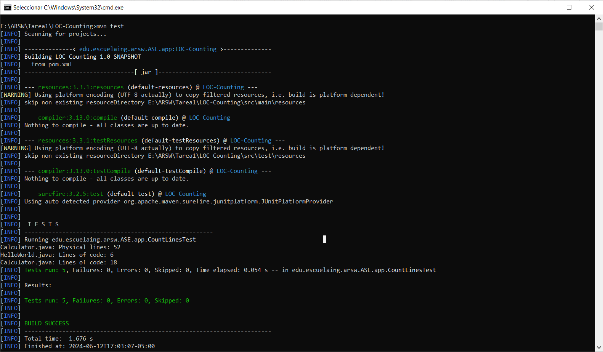
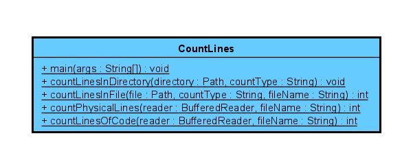

# Introduction to Maven, GIT, GitHub

Introduction to Maven, GIT, GitHub: Learning essential tools for efficient project management and collaboration in software development.

## Getting Started
Download the project from 
[the repository.](https://github.com/Sebasvasquezz/Lab1-Intro-Maven-Git-GitHub)

### Prerequisites

* [Maven](https://maven.apache.org/): Automate and standardize the life flow of software construction

* [Git](https://www.git-scm.com/): Decentralized Configuration Manager

### Installing
1. Maven
    * Download Maven in http://maven.apache.org/download.html
    * You need to have Java installed (7 or 8)
    * Follow the instructions in http://maven.apache.org/download.html#Installation

2. Git
    * Download git in https://git-scm.com/download/win
    * Follow the instructions in https://git-scm.com/book/en/v2/Getting-Started-Installing-Git

## Deployment

### Creating a project
* Open an operating system shell
* Go to the directory where you will store this project
* Run the following commands:

    ```
    mvn archetype:generate -DgroupId=edu.escuelaing.arsw.ASE.app -DartifactId=miprimera-app -DarchetypeArtifactId=maven-archetype-quickstart -DinteractiveMode=false
    ```
    ```
    cd mi-primera-app/
    ```
* The most important files that were created:
    * App.java source code:

    

    * The pom.xml:

    

    * The project coordinates are:
    ```
    <groupId>edu.escuelaing.app</groupId>
    <artifactId>mi-primera-app</artifactId>
    <version>1.0-SNAPSHOT</version>
    ```
### Build the project
* Run the comand:
    ```
    mvn package
    ```
* Run the application:
    ```
    java -cp target/mi-primera-app-1.0-SNAPSHOT.jar
    edu.escuelaing.arsw.ASE.app.App
    ```
* And the execution:
    ```
    Hello World!
    ```
### Phase architecture
* To generate the Javadoc as part of the site you must add the javadoc plugin to the
part of reports in the POM.
    ```
    <reporting>
        <plugins>
        <plugin>
            <groupId>org.apache.maven.plugins</groupId>
            <artifactId>maven-javadoc-plugin</artifactId>
            <version>2.10.1</version>
        </plugin>
        </plugins>
    </reporting>
    ```
* If you want to generate the javadoc as a separate element of the documentation,
To package it in the JAR you must add the plugin in the build section.
    ```
    <build>
        <plugins>
        <plugin>
            <groupId>org.apache.maven.plugins</groupId>
            <artifactId>maven-javadoc-plugin</artifactId>
            <version>2.10.1</version>
        </plugin>
        </plugins>
    </build>
    ```
* Commands to generate reports:
    ```
    mvn javadoc:javadoc
    mvn javadoc:jar
    mvn javadoc:aggregate
    mvn javadoc:aggregate-jar
    mvn javadoc:test-javadoc
    mvn javadoc:test-jar
    mvn javadoc:test-aggregate
    mvn javadoc:test-aggregate-jar
    ```
* This generates the javadocs and packages them with the Jar.
## Built With

* [Maven](https://maven.apache.org/) - Dependency Management

## Authors

* **Juan Sebastian Vasquez Vega**  - [Sebasvasquezz](https://github.com/Sebasvasquezz)

## License

This project is licensed under the GNU License - see the [LICENSE.md](LICENSE.md) file for details.

